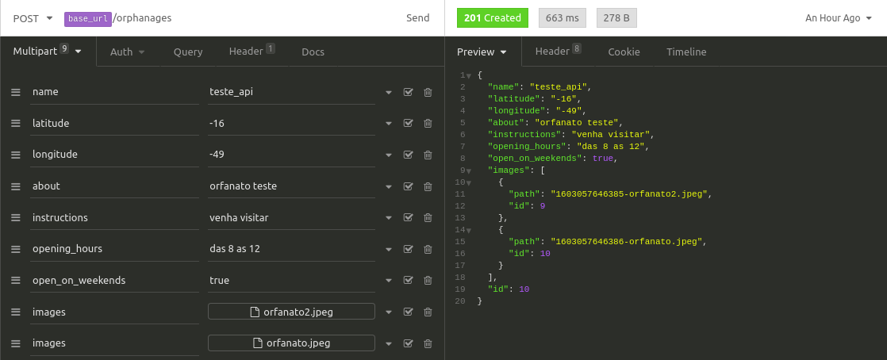

# Happy
An app to connect volunteers with orphanages. Designed by Rocketseat at their intensive training "Next Level Week 3".

### Technologies
  - Node.js
  - React.js
  - JavaScript
  - TypeScript
  - HTML
  - CSS

## Front-end
For front-end we used create-react-app to initialize a React structure with Typescript template.

The application uses a map as core of its functionality. Here we can look for orphanages on the map or register one.

The orphanages data are gotten and registered through the RESTful API we created.

### There are four pages:
  - Landing
  - The map
  - Orphanage details
  - Register orphanage page

### The React concepts aborded on this project were:
  - Components props
  - Components state
  - Components hooks
  - Components reuse

## Back-end
For back-end, a RESTful API was constructed with just one resource 'orphanage' where we can create, list all or list one.

The MVC patter was chosen for this project, making easy to abstract the business rules from the routes and changing what and how the information will be sent to the front-end client.

An ORM was set to control the database wich is a SQLite in this example just for educational purpose and easy setup.

Migrations was configured so anyone can easily setup the database to test the app.

Because we are using TypeORM we can change the database in the application any time without big problems, for example when we want to launch this for real production.

